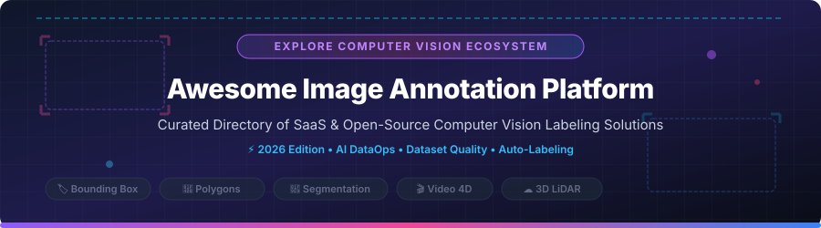

  

  
  
  
  
  
  

# 🚀 Awesome Image Annotation Platform

> **A curated directory of top SaaS products and open-source GitHub tools for Computer Vision Data Labeling, Polygon Segmentation, Bounding Box Annotation, 3D LiDAR, Video Tracking, and AI DataOps Pipelines.**

---

## 📌 Table of Contents
- [📊 Market Overview & Industry Dynamics](#-market-overview--industry-dynamics)
- [🏢 SaaS & Cloud Annotation Platforms](#-saas--cloud-annotation-platforms)
- [💻 Open-Source GitHub Projects](#-open-source-github-projects)
- [🛠️ Feature Comparison & Workflow Selection](#-feature-comparison--workflow-selection)
- [🤝 How to Contribute](#-how-to-contribute)
- [💖 Support & Sponsorship](#-support--sponsorship)
- [📈 Star History](#-star-history)
- [📜 Disclaimer](#-disclaimer)

---

## 📊 Market Overview & Industry Dynamics

The global **AI Data Annotation Tools market size is estimated at ~$3.2 Billion in 2026** and is projected to reach **$13.5 Billion by 2032** growing at a CAGR of **~27%**. The sector is currently **moderately fragmented**, characterized by high-growth enterprise SaaS platform leaders (such as Scale AI, Labelbox, and Encord) alongside a thriving, highly active open-source ecosystem (such as Label Studio, SAM, and CVAT) catering to custom infrastructure and data privacy requirements.

---

## 🏢 SaaS & Cloud Annotation Platforms

*SaaS annotation platforms offer enterprise-grade collaboration, automated ML-assisted labeling (SAM, Segment Anything), quality control (QA) workflows, workforce management, and cloud infrastructure integration.*

| SaaS Platform | Company Size / Valuation | Starting Price | Free Tier / Trial Limits | Core Capabilities & Focus |
| :--- | :--- | :--- | :--- | :--- |
| **[TELUS AI / Playment](https://www.playment.io/)** 🏷️ | **~$1.2 Billion** (Parent Market Cap / $100M+ acquisition) | **$0.08 / annotation** (or $500/mo project spend) | **14-day free trial** (Up to 500 free annotations) | Enterprise computer vision labeling & managed human workforce services. |
| **[Labelbox](https://labelbox.com/)** 📦 | **~$900 Million** ($110M funding) | **$0.10 / LBU** (Starter pay-as-you-go tier) | **Free Forever** (500 LBUs/mo & 1,500 API calls/min) | DataOps platform, model-assisted auto-labeling, multimodal QA. |
| **[Encord](https://encord.com/)** 🩺 | **~$550 Million** ($110M funding) | **$299 / month** (Starter plan) | **14-day free trial** (Up to 500 files & basic workflows) | DICOM/NIfTI medical imaging, active learning, AI micro-models. |
| **[SuperAnnotate](https://www.superannotate.com/)** ⚡ | **~$150 Million** ($36M funding) | **$62 / user / month** (Starter plan) | **14-day free trial** (Up to 1,000 items & 3 user seats) | Fine-grained segmentation, LLM/CV evaluation, QA pipelines. |
| **[Dataloop](https://dataloop.ai/)** 🔄 | **~$120 Million** ($50M funding) | **$100 / month** Base ($0.05/credit pay-as-you-go) | **14-day free trial** (1,000 free platform credits) | End-to-end dataset management, automation pipelines, human-in-the-loop. |
| **[V7 Labs (Darwin)](https://www.v7labs.com/)** 🧬 | **~$100 Million** ($36M funding / ~$27.7M revenue) | **$32 / user / month** (Pro plan) | **Free Personal Tier** (500 images/mo, 1 user seat) | AI auto-segmentation, zero-shot labeling, medical & video support. |
| **[Kili Technology](https://kili-technology.com/)** ✨ | **~$80 Million** ($30.7M funding / ~$6.7M revenue) | **$249 / month** (Developer plan) | **14-day free trial** (Up to 1,000 labeled evaluation items) | Quality control workflows, consensus scoring, fast labeling interfaces. |
| **[CVAT.ai (Cloud)](https://www.cvat.ai/)** 👁️ | **~$25 Million** ($100K pre-seed / ~$9.6M revenue) | **$23 / user / month** (Solo Annual plan) | **Free Forever** (1 user, 10 tasks, 500MB cloud storage limit) | Hosted CVAT server, AI models integration, semi-automatic labeling. |
| **[Supervisely](https://supervisely.com/)** 🌐 | **~$15 Million** (Bootstrapped / ~$1.4M revenue) | **$49 / user / month** (Team plan) | **Free Community Tier** (5GB storage, max 10,000 files/images) | Ecosystem with custom apps, neural network training, 3D LiDAR support. |
| **[Keymakr](https://keymakr.com/)** 🔑 | **~$5 Million** (Bootstrapped studio) | **$99 / month** (Startup plan) | **7-day free trial** (Access for up to 500 test images) | In-house pixel-precise annotation, synthetic dataset creation. |

---

## 💻 Open-Source GitHub Projects

*Open-source annotation tools give machine learning engineers full ownership of data privacy, local infrastructure control, and custom labeling frontend extensibility. Sorted by GitHub Stars_Count (descending).*

1. **[Segment Anything (SAM)](https://github.com/facebookresearch/segment-anything)**  🎯  
   Meta AI's foundation model for image segmentation, revolutionizing interactive zero-shot auto-labeling across computer vision workflows.

2. **[Label Studio](https://github.com/HumanSignal/label-studio)**  🏷️  
   Multi-modal open-source data labeling tool supporting images, audio, text, video, and time-series datasets with customizable UI templates.

3. **[LabelImg](https://github.com/tzutalin/labelImg)**  🖼️  
   Classic lightweight desktop graphical image annotation tool for PASCAL VOC and YOLO bounding box formats.

4. **[CVAT (Computer Vision Annotation Tool)](https://github.com/cvat-ai/cvat)**  🎥  
   Leading full-featured open-source web annotation platform for computer vision: video object tracking, 3D LiDAR point clouds, polygon segmentation, and team management.

5. **[Labelme](https://github.com/wkentaro/labelme)**  📐  
   Popular Python-based desktop polygon annotation tool for image dataset creation with JSON exports.

6. **[FiftyOne](https://github.com/voxel51/fiftyone)**  📊  
   Open-source dataset curation, visualization, and model debugging platform integrated with popular annotation tools.

7. **[Doccano](https://github.com/doccano/doccano)**  📝  
   Open-source web text annotation tool, frequently paired with image tools in multimodal AI pipelines.

8. **[VoTT (Visual Object Tagging Tool)](https://github.com/microsoft/VoTT)**  🎬  
   Microsoft open-source electron app for video and image object detection dataset annotation.

9. **[AnyLabeling](https://github.com/AnyLabeling/AnyLabeling)**  🤖  
   Auto-labeling desktop application powered by Segment Anything (SAM) and YOLO for rapid polygon & bounding box annotation.

10. **[Make Sense](https://github.com/SkalskiP/make-sense)**  🌐  
    Free browser-based image annotation tool requiring no backend installation or data uploads.

11. **[Annotorious](https://github.com/annotorious/annotorious)**  🧩  
    Lightweight JavaScript library for image annotation on web pages and custom frontend integrations.

12. **[Scalabel](https://github.com/scalabel/scalabel)**  🚗  
    Scalable web-based annotation platform for 2D/3D bounding boxes, polygon segmentation, and autonomous driving video tracking.

---

## 🛠️ Feature Comparison & Workflow Selection

* **For Production Computer Vision Teams:** Deploy **CVAT** or **Label Studio** self-hosted for complete privacy, or choose **Labelbox** / **Encord** for managed scale.
* **For Quick Desktop Labeling:** Use **Labelme** or **AnyLabeling** (with integrated SAM AI model assistance).
* **For Dataset Curation & Quality:** Combine **FiftyOne** with open annotation pipelines to visualize annotations and filter dataset edge cases.
* **For Multimodal AI:** Choose **Label Studio** or **Labelbox** for unified vision, text, and audio labeling.

---

## 🤝 How to Contribute

Contributions are highly welcome! Please follow these simple steps:
1. Fork this repository.
2. Add or update entries in `README.md` maintaining the table/badge formatting.
3. Submit a Pull Request describing your changes.

Check out our curated meta-list at **[Awesome-Awesome-Awesome](https://github.com/ishandutta2007/Awesome-Awesome-Awesome)** for more incredible resource directories!

---

## 💖 Support & Sponsorship

Thank you for exploring and using **Awesome Image Annotation Platform**! If you find this directory valuable for your machine learning projects or dataset pipeline research:

- 🌟 **Star** this repository on GitHub to show your appreciation!
- 🔀 **Fork** and share it with your computer vision and data engineering teams!
- ☕ **Sponsor / Buy me a coffee**: If you'd like to support ongoing maintenance and curated datasets, consider sponsoring via the [GitHub Sponsor Dashboard](https://github.com/sponsors/ishandutta2007).

---

## 📈 Star History

---

## 📜 Disclaimer

*This list is community-curated for informational purposes. Pricing, valuation, and GitHub statistics reflect reported figures as of September 2026 and are subject to change. Always refer to official product documentation.*
